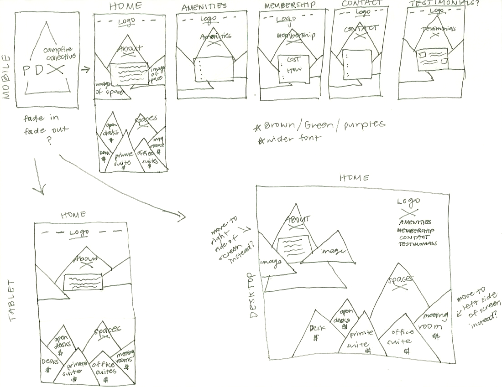
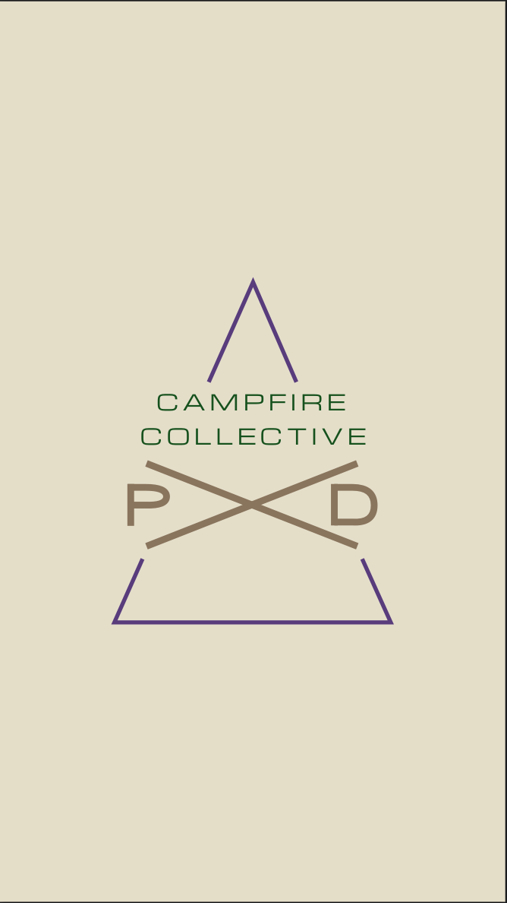
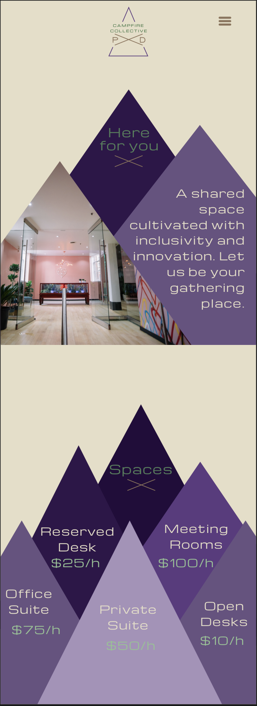
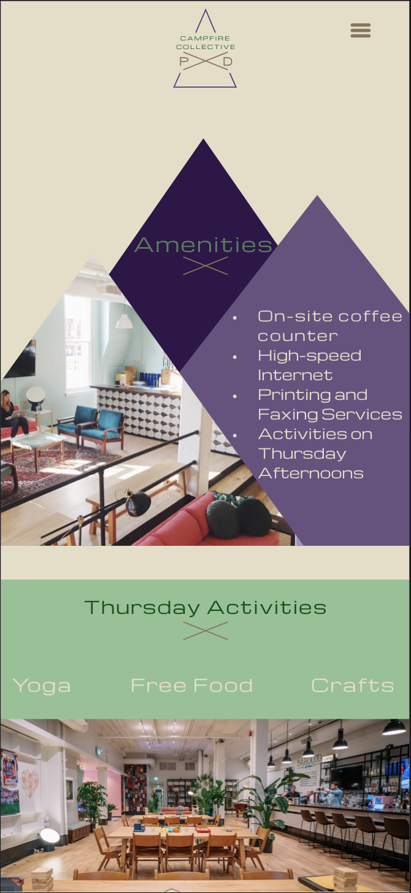
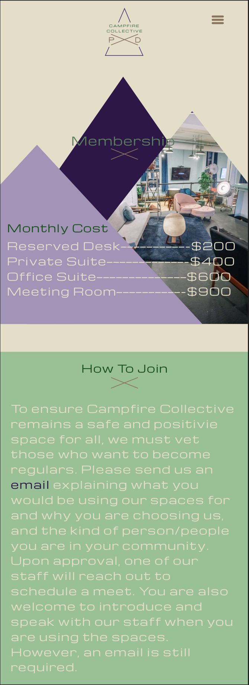
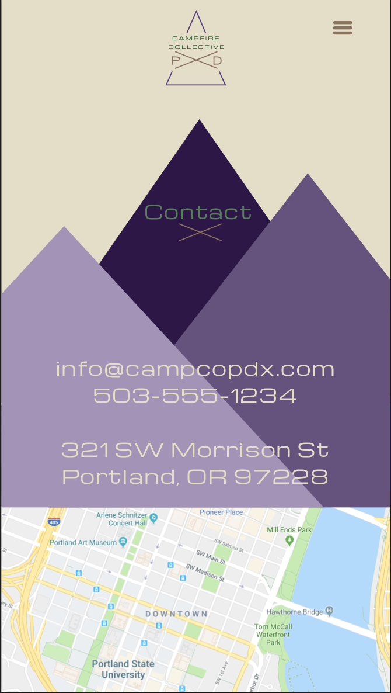
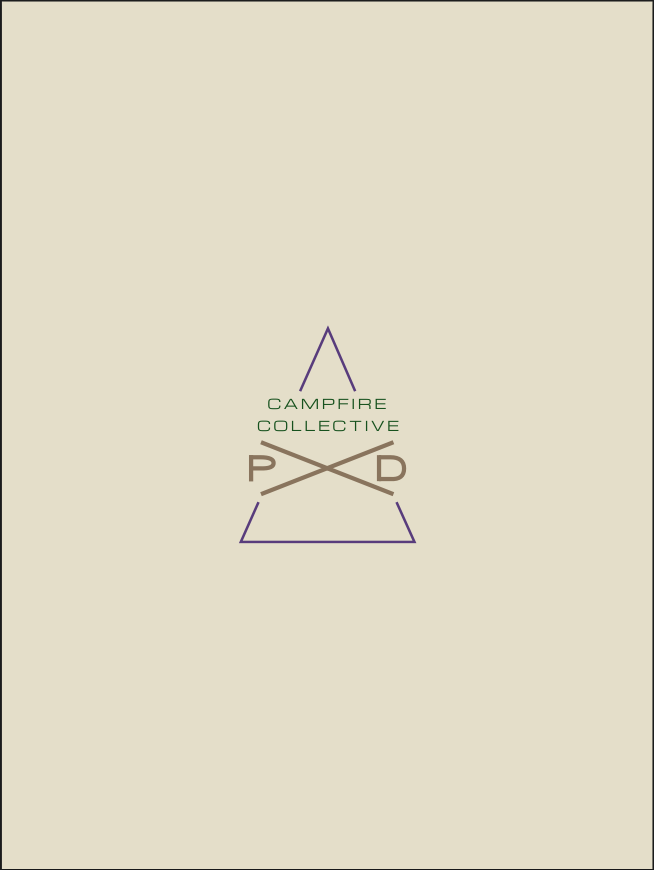
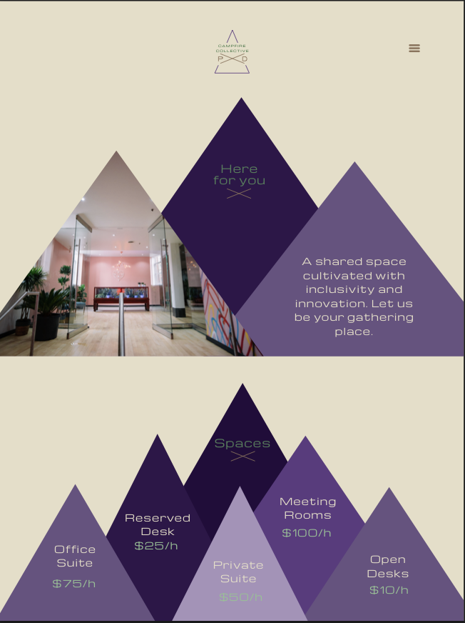
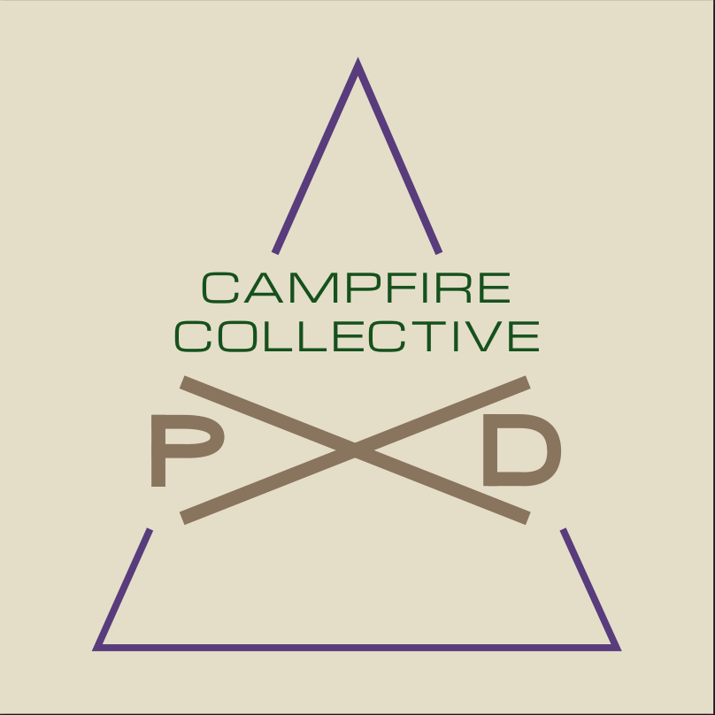
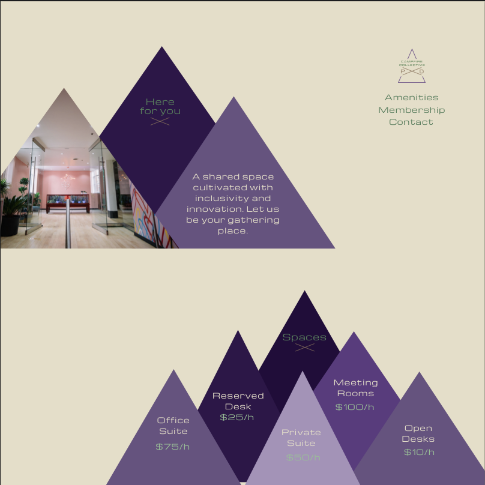

# _Campfire Collective PDX_

#### _Front End Development/User Interfaces, Part 1: Week 7 - Two-Week Independent Project, 2/22/19_

#### By _**Randee Layosa**_

## Description

_This app is a mock-up site for a pseudo co-working startup that demonstrates my understanding and efficiency in the Web Design Process. The theoretical idea is that artists of any trade can and should feel comfortable in the shared space, and can utilize it to start up or further their business. Upon landing on the home page, visitors can get a feel for the cool atmosphere vibe and look up the types of spaces available to rent, with its corresponding prices. Viewers can easily get a sense of the space and the amenities offered, membership requirements and benefits, and how to become one._

## Paper Sketch

#### _Mobile, Tablet, Desktop_

  

## Sketch Wireframes

#### _Mobile_

  
  
  
  
  

#### _Tablet_

  
  

#### _Desktop_

  
  

## User Stories

#### _Target Users_
* _Freelancers_
  * _Artists, Web Developers, Daytraders, Craftspeople, Writers, Counselors_
* _Business people_
* _Startups_

#### _User Personas_
* _As an interested party (freelancer, artist, web developer, writer, craftsperson, daytrader, counselor, business person, business startup), I want to be able to rent a space for myself or my team._
* _As an interested party, I want to be able to pay monthly or daily for the spaces._
* _As an interested party, I want to have information regarding amenities and benefits of the space clearly and easily available for me to find or see._
* _As a freelancer (artist, web developer, writer, craftsperson, daytrader), I want to feel welcomed and safe in my workspace, and be able to gather such information from the website._
* _As a counselor, business person, and/or startup, I want be able to easily discern whether this space is conducive to my personal needs and those of my clients’._
* _As a user of the space, I want to be able to easily find and learn who or what to do if I have a matter or issue that needs tending to._
* _As a satisfied user of the space, I want to be able to post a testimonial on the the site so that others will be compelled to join._

## Research

#### _How To Accomplish Client's Wants_
* _Maintain a clean and modern design, leaning more towards a minimalistic aesthetic._
* _Utilize a bright color scheme, pairing with neutral colors as to maintain aesthetic tastefulness._
* _Include creative images and photos of people smiling._
* _Include verbiage of inclusivity and the amenities offered that cater to a cohesive space._

#### _Outside Inspiration_
* _I researched co-working spaces around the Portland area and kept note of what I wanted to emulate and avoid._
  * _The Crossing - layout/aesthetic, color scheme_
  * _CENTRL Office - layout, page info provided_
  * _Liquid Space - amenities block at bottom of page_
  * _WeWork - amenities block_
  * _Urban Office - clean (less clutter), membership page_
  * _Regus - avoid this look (very corporate)_
  * _Collective Agency - calendar page, mobile view look_

## Technology Resources

* _{List all technologies and outside resources your project uses. Especially when we begin using outside UI frameworks in week three! Not only does this give credit where credit is due, but it shows employers what tools you're experienced in.}_

## Setup/Installation Requirements

* _Go to this link to view the page on GitHub "https://github.com/randeelayosa/coworking.git"_
* _Or, you can clone this repository "https://github.com/randeelayosa/coworking.git"_
* _Open the repository in the text editor of your preference. (i.e. Atom.)_
* _Open the file in the web browser of your preference._
* _{Similar to what we've done in previous courses, describe the steps necessary to launch this project in Sketch.}_

## Responsiveness

_{After we begin creating responsive sites in week 3, you should also include a description of how this site is responsive. Does it include both mobile and desktop versions? Mobile, desktop and tablet? List that information here.}_

## Developmental Roadmap

_{Is there work you plan on continuing doing on this project? Features you'd like to add? If so, describe what your future intentions are in this section.}_

## Technologies Used

* _Sketch_
* _Sass_

### Legal

*This software is licensed under MIT license.*

Copyright (c) 2019 **_Randee Layosa_**
